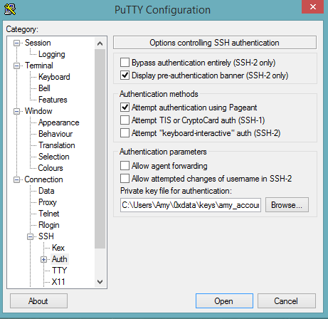
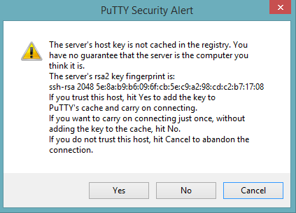

#Running on EC2

**Note**: If you would like to try out H2O on an EC2 cluster, <a href="http://play.h2o.ai/login" target="_blank">play.h2o.ai</a> is the easiest way to get started. H2O Play provides access to a temporary cluster managed by H2O. 

If you would still like to set up your own EC2 cluster, follow the instructions below. Make sure you have already <a href="https://github.com/h2oai/h2o-dev/blob/master/h2o-docs/src/product/howto/H2O-DevS3Creds.md" target="_blank">passed your S3 credentials to H2O</a>.

 >Tested on Redhat AMI, Amazon Linux AMI, and Ubuntu AMI

##Launch H2O

**Note**: Before launching H2O on an EC2 cluster, verify that ports `54321` and `54322` are both accessible by TCP and UDP. 

###Selecting the Operating System and Virtualization Type

Select your operating system and the virtualization type of the prebuilt AMI on Amazon. If you are using Windows, you will need to use a hardware-assisted virtual machine (HVM). If you are using Linux, you can choose between para-virtualization (PV) and HVM. These selections determine the type of instances you can launch. 

  

For more information about virtualization types, refer to [Amazon](http://docs.aws.amazon.com/AWSEC2/latest/UserGuide/virtualization_types.html). 

###Configuring the Instance

0. Select the IAM role and policy to use to launch the instance. H2O detects the temporary access keys associated with the instance, so you don't need to copy your AWS credentials to the instances. 

  

0. When launching the instance, select an accessible key pair. 

  

####(Windows Users) Tunneling into the Instance

For Windows users that do not have the ability to use `ssh` from the terminal, either download Cygwin or a Git Bash that has the capability to run `ssh`:

`ssh -i amy_account.pem ec2-user@54.165.25.98`

Otherwise, download PuTTY and follow these instructions:

0. Launch the PuTTY Key Generator. 
0. Load your downloaded AWS pem key file. 
   **Note:** To see the file, change the browser file type to "All". 
0. Save the private key as a .ppk file. 

  

0. Launch the PuTTY client. 
0. In the *Session* section, enter the host name or IP address. For Ubuntu users, the default host name is `ubuntu@<ip-address>`. For Linux users, the default host name is `ec2-user@<ip-address>`.  

  

0. Select *SSH*, then *Auth* in the sidebar, and click the **Browse** button to select the private key file for authentication. 

  

0. Start a new session and click the **Yes** button to confirm caching of the server's rsa2 key fingerprint and continue connecting. 

  

###Downloading Java and H2O

0. Download [Java](http://www.oracle.com/technetwork/java/javase/downloads/jdk7-downloads-1880260.html
) (JDK 1.7 or later) if it is not already available on the instance. 
0. To download H2O, run the `wget` command with the link to the zip file available on our [website](http://h2o.ai/download/) by copying the link associated with the **Download** button for the selected H2O build. 
	
		wget http://h2o-release.s3.amazonaws.com/h2o-dev/rel-serre/1/index.html
		unzip h2o-dev-0.2.1.1.zip
		cd h2o-dev-0.2.1.1
		java -Xmx4g -jar h2o.jar
0. From your browser, navigate to `<Private_IP_Address>:54321` or `<Public_DNS>:54321` to use H2O's web interface. 

##Launch H2O from the Command Line

##Important Notes

Java is a pre-requisite for H2O; if you do not already have Java installed, make sure to install it before installing H2O. Java is available free on the web,
and can be installed quickly. Although Java is required to 
run H2O, no programming is necessary.
For users that only want to run H2O without compiling their own code, [Java Runtime Environment](https://www.java.com/en/download/) (version 1.6 or later) is sufficient, but for users planning on compiling their own builds, we strongly recommend using [Java Development Kit 1.7](www.oracle.com/technetwork/java/javase/downloads/) or later. 

After installation, launch H2O using the argument `-Xmx`. Xmx is the
amount of memory given to H2O.  If your data set is large,
allocate more memory to H2O by using `-Xmx4g` instead of the default `-Xmx1g`, which will allocate 4g instead of the default 1g to your instance. For best performance, the amount of memory allocated to H2O should be four times the size of your data, but never more than the total amount of memory on your computer.

##Step-by-Step Walk-Through

1. Download the .zip file containing the latest release of H2O from the
   [H2O downloads page](http://h2o.ai/download/).

2. From your terminal, change your working directory to the same directory as the location of the .zip file.

3. From your terminal, unzip the .zip file.  For example, `unzip h2o-dev-0.2.1.1.zip`. 

4. At the prompt, enter the following commands:

		cd h2o-dev-0.2.1.1  #change working directory to the downloaded file
		java -Xmx4g -jar h2o.jar #run the basic java command to start h2o

5. After a few moments, output similar to the following appears in your terminal window:

		 03-23 14:57:52.930 172.16.2.39:54321     1932   main      INFO: ----- H2O started  -----
		03-23 14:57:52.997 172.16.2.39:54321     1932   main      INFO: Build git branch: rel-serre
		03-23 14:57:52.998 172.16.2.39:54321     1932   main      INFO: Build git hash: 9eaa5f0c4ca39144b1fd180aedb535b5ba08b2ce
		03-23 14:57:52.998 172.16.2.39:54321     1932   main      INFO: Build git describe: jenkins-rel-serre-1
		03-23 14:57:52.998 172.16.2.39:54321     1932   main      INFO: Build project version: 0.2.1.1
		03-23 14:57:52.998 172.16.2.39:54321     1932   main      INFO: Built by: 'jenkins'
		03-23 14:57:52.998 172.16.2.39:54321     1932   main      INFO: Built on: '2015-03-18 12:55:28'
		03-23 14:57:52.998 172.16.2.39:54321     1932   main      INFO: Java availableProcessors: 8
		03-23 14:57:52.999 172.16.2.39:54321     1932   main      INFO: Java heap totalMemory: 245.5 MB
		03-23 14:57:52.999 172.16.2.39:54321     1932   main      INFO: Java heap maxMemory: 3.56 GB
		03-23 14:57:52.999 172.16.2.39:54321     1932   main      INFO: Java version: Java 1.7.0_67 (from Oracle Corporation)
		03-23 14:57:52.999 172.16.2.39:54321     1932   main      INFO: OS   version: Mac OS X 10.10.2 (x86_64)
		03-23 14:57:52.999 172.16.2.39:54321     1932   main      INFO: Machine physical memory: 16.00 GB
		03-23 14:57:52.999 172.16.2.39:54321     1932   main      INFO: Possible IP Address: en5 (en5), fe80:0:0:0:daeb:97ff:feb3:6d4b%10
		03-23 14:57:52.999 172.16.2.39:54321     1932   main      INFO: Possible IP Address: en5 (en5), 172.16.2.39
		03-23 14:57:53.000 172.16.2.39:54321     1932   main      INFO: Possible IP Address: lo0 (lo0), fe80:0:0:0:0:0:0:1%1
		03-23 14:57:53.000 172.16.2.39:54321     1932   main      INFO: Possible IP Address: lo0 (lo0), 0:0:0:0:0:0:0:1
		03-23 14:57:53.000 172.16.2.39:54321     1932   main      INFO: Possible IP Address: lo0 (lo0), 127.0.0.1
		03-23 14:57:53.000 172.16.2.39:54321     1932   main      INFO: Internal communication uses port: 54322
		03-23 14:57:53.000 172.16.2.39:54321     1932   main      INFO: Listening for HTTP and REST traffic on  http://172.16.2.39:54321/
		03-23 14:57:53.001 172.16.2.39:54321     1932   main      INFO: H2O cloud name: 'H2O-Dev-User' on /172.16.2.39:54321, discovery address /238.222.48.136:61150
		03-23 14:57:53.001 172.16.2.39:54321     1932   main      INFO: If you have trouble connecting, try SSH tunneling from your local machine (e.g., via port 55555):
		03-23 14:57:53.001 172.16.2.39:54321     1932   main      INFO:   1. Open a terminal and run 'ssh -L 55555:localhost:54321 H2O-Dev-User@172.16.2.39'
		03-23 14:57:53.001 172.16.2.39:54321     1932   main      INFO:   2. Point your browser to http://localhost:55555
		03-23 14:57:53.211 172.16.2.39:54321     1932   main      INFO: Log dir: '/tmp/h2o-H2O-Dev-User/h2ologs'
		03-23 14:57:53.211 172.16.2.39:54321     1932   main      INFO: Cur dir: '/Users/H2O-Dev-User/Downloads/h2o-dev-0.2.1.1'
		03-23 14:57:53.234 172.16.2.39:54321     1932   main      INFO: HDFS subsystem successfully initialized
		03-23 14:57:53.234 172.16.2.39:54321     1932   main      INFO: S3 subsystem successfully initialized
		03-23 14:57:53.235 172.16.2.39:54321     1932   main      INFO: Flow dir: '/Users/H2O-Dev-User/h2oflows'
		03-23 14:57:53.248 172.16.2.39:54321     1932   main      INFO: Cloud of size 1 formed [/172.16.2.39:54321]
		03-23 14:57:53.776 172.16.2.39:54321     1932   main      WARN: Found schema field which violates the naming convention; name has mixed lowercase and uppercase characters: ModelParametersSchema.dropNA20Cols
		03-23 14:57:53.935 172.16.2.39:54321     1932   main      INFO: Registered: 142 schemas in: 605mS

5. Point your web browser to `http://localhost:54321/` 

The user interface appears in your browser, and now H2O is ready to go.

**WARNING**: 
  On Windows systems, Internet Explorer is frequently blocked due to
  security settings.  If you cannot reach http://localhost:54321, try using a different web browser, such as Firefox or Chrome.
