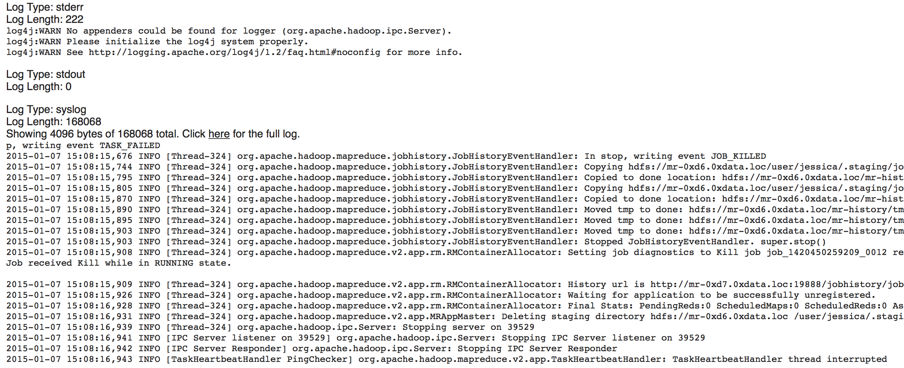
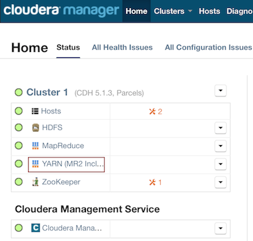
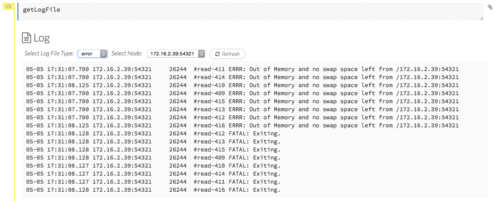

#Downloading Logs


##Accessing Logs

Depending on whether you are using Hadoop with H2O and whether the job is currently running, there are different ways of obtaining the logs for H2O. 

Copy and email the logs to support@h2o.ai or submit them to h2ostream@googlegroups.com with a brief description of your Hadoop environment, including the Hadoop distribution and version.

###Without Running Jobs

- If you are using Hadoop and the job is not running, view the logs by using the `yarn logs -applicationId` command. When you start an H2O instance, the complete command displays in the output: 

```
	jessica@mr-0x8:~/h2o-dev-0.3.0.1187-cdh5.2$ hadoop jar h2odriver.jar -nodes 1 -mapperXmx 1g -output hdfsOutputDirName
Determining driver host interface for mapper->driver callback...
    [Possible callback IP address: 172.16.2.178]
    [Possible callback IP address: 127.0.0.1]
Using mapper->driver callback IP address and port: 172.16.2.178:52030
(You can override these with -driverif and -driverport.)
Memory Settings:
    mapreduce.map.java.opts:     -Xms1g -Xmx1g -Dlog4j.defaultInitOverride=true
    Extra memory percent:        10
    mapreduce.map.memory.mb:     1126
15/05/06 17:11:50 INFO client.RMProxy: Connecting to ResourceManager at mr-0x10.0xdata.loc/172.16.2.180:8032
15/05/06 17:11:52 INFO mapreduce.JobSubmitter: number of splits:1
15/05/06 17:11:52 INFO mapreduce.JobSubmitter: Submitting tokens for job: job_1430127035640_0075
15/05/06 17:11:52 INFO impl.YarnClientImpl: Submitted application application_1430127035640_0075
15/05/06 17:11:52 INFO mapreduce.Job: The url to track the job: http://mr-0x10.0xdata.loc:8088/proxy/application_1430127035640_0075/
Job name 'H2O_29570' submitted
JobTracker job ID is 'job_1430127035640_0075'
For YARN users, logs command is 'yarn logs -applicationId application_1430127035640_0075'
Waiting for H2O cluster to come up...

```


In the above example, the command is specified in the next to last line (`For YARN users, logs command is...`). The command is unique for each instance. In Terminal, enter `yarn logs -applicationId application_<UniqueID>` to view the logs (where `<UniqueID>` is the number specified in the next to last line of the output that displayed when you created the cluster). 
	
---

Use YARN to obtain the `stdout` and `stderr` logs that are used for troubleshooting. To learn how to access YARN based on management software, version, and job status, see [Accessing YARN](#AccessYARN). 

0. Click the **Applications** link to view all jobs, then click the **History** link for the job.
 
  

0. Click the **logs** link. 
	
	
	
0. 	Copy the information that displays and send it in an email to support@h2o.ai. 
	
	
 
---

###With Running Jobs


If you are using Hadoop and the job is still running: 

- Use YARN to obtain the `stdout` and `stderr` logs that are used for troubleshooting. To learn how to access YARN based on management software, version, and job status, see [Accessing YARN](#AccessYARN).

0. Click the **Applications** link to view all jobs, then click the **ApplicationMaster** link for the job. 
	
	

0. Select the job from the list of active jobs. 
	
	
	
0. Click the **logs** link. 
	
	 
	
0. 	Send the contents of the displayed files to support@h2o.ai. 
	
	
	
---

- Go to the H2O web UI and select **Admin** > **View Log**. To filter the results select a node or log file type from the drop-down menus. To download the logs, click the **Download Logs** button. 

 When you view the log, the output displays the location of log directory after `Log dir:` (as shown in the last line in the following example): 

```
05-06 17:12:15.610 172.16.2.179:54321    26336  main      INFO: ----- H2O started  -----
05-06 17:12:15.731 172.16.2.179:54321    26336  main      INFO: Build git branch: master
05-06 17:12:15.731 172.16.2.179:54321    26336  main      INFO: Build git hash: 41d039196088df081ad77610d3e2d6550868f11b
05-06 17:12:15.731 172.16.2.179:54321    26336  main      INFO: Build git describe: jenkins-master-1187
05-06 17:12:15.732 172.16.2.179:54321    26336  main      INFO: Build project version: 0.3.0.1187
05-06 17:12:15.732 172.16.2.179:54321    26336  main      INFO: Built by: 'jenkins'
05-06 17:12:15.732 172.16.2.179:54321    26336  main      INFO: Built on: '2015-05-05 23:31:12'
05-06 17:12:15.732 172.16.2.179:54321    26336  main      INFO: Java availableProcessors: 8
05-06 17:12:15.732 172.16.2.179:54321    26336  main      INFO: Java heap totalMemory: 982.0 MB
05-06 17:12:15.732 172.16.2.179:54321    26336  main      INFO: Java heap maxMemory: 982.0 MB
05-06 17:12:15.732 172.16.2.179:54321    26336  main      INFO: Java version: Java 1.7.0_80 (from Oracle Corporation)
05-06 17:12:15.733 172.16.2.179:54321    26336  main      INFO: OS   version: Linux 3.13.0-51-generic (amd64)
05-06 17:12:15.733 172.16.2.179:54321    26336  main      INFO: Machine physical memory: 31.30 GB
05-06 17:12:15.733 172.16.2.179:54321    26336  main      INFO: X-h2o-cluster-id: 1430957535344
05-06 17:12:15.733 172.16.2.179:54321    26336  main      INFO: Possible IP Address: virbr0 (virbr0), 192.168.122.1
05-06 17:12:15.733 172.16.2.179:54321    26336  main      INFO: Possible IP Address: br0 (br0), 172.16.2.179
05-06 17:12:15.733 172.16.2.179:54321    26336  main      INFO: Possible IP Address: lo (lo), 127.0.0.1
05-06 17:12:15.733 172.16.2.179:54321    26336  main      INFO: Multiple local IPs detected:
05-06 17:12:15.733 172.16.2.179:54321    26336  main      INFO:   /192.168.122.1  /172.16.2.179
05-06 17:12:15.733 172.16.2.179:54321    26336  main      INFO: Attempting to determine correct address...
05-06 17:12:15.733 172.16.2.179:54321    26336  main      INFO: Using /172.16.2.179
05-06 17:12:15.734 172.16.2.179:54321    26336  main      INFO: Internal communication uses port: 54322
05-06 17:12:15.734 172.16.2.179:54321    26336  main      INFO: Listening for HTTP and REST traffic on  http://172.16.2.179:54321/
05-06 17:12:15.744 172.16.2.179:54321    26336  main      INFO: H2O cloud name: 'H2O_29570' on /172.16.2.179:54321, discovery address /237.61.246.13:60733
05-06 17:12:15.744 172.16.2.179:54321    26336  main      INFO: If you have trouble connecting, try SSH tunneling from your local machine (e.g., via port 55555):
05-06 17:12:15.744 172.16.2.179:54321    26336  main      INFO:   1. Open a terminal and run 'ssh -L 55555:localhost:54321 yarn@172.16.2.179'
05-06 17:12:15.744 172.16.2.179:54321    26336  main      INFO:   2. Point your browser to http://localhost:55555
05-06 17:12:15.979 172.16.2.179:54321    26336  main      INFO: Log dir: '/home2/yarn/nm/usercache/jessica/appcache/application_1430127035640_0075/h2ologs'
``` 

---

-  In Terminal, enter `cd /tmp/h2o-<UserName>/h2ologs` (where `<UserName>` is your computer user name), then enter `ls -l` to view a list of the log files. The `httpd` log contains the request/response status of all REST API transactions. 
  The rest of the logs use the format `h2o_\<IPaddress>\_<Port>-<LogLevel>-<LogLevelName>.log`, where `<IPaddress>` is the bind address of the H2O instance, `<Port>` is the port number, `<LogLevel>` is the numerical log level (1-6, with 6 as the highest severity level), and `<LogLevelName>` is the name of the log level (trace, debug, info, warn, error, or fatal). 

---

- Download the logs using R. In R, enter the command `h2o.downloadAllLogs(client = localH2O,filename = "logs.zip")` (where `client` is the H2O cluster and `filename` is the specified filename for the logs).

---

<a name="AccessYARN"></a>
##Accessing YARN

Methods for accessing YARN vary depending on the default management software and version, as well as job status. 


---
 
###Cloudera 5 & 5.2


1. In Cloudera Manager, click the **YARN** link in the cluster section.

  
  
2. In the Quick Links section, select **ResourceManager Web UI** if the job is running or select **HistoryServer Web UI** if the job is not running. 

 

---
 
###Ambari


1. From the Ambari Dashboard, select **YARN**. 

  

2. From the Quick Links drop-down menu, select **ResourceManager UI**.   

  

---

##For Non-Hadoop Users

###Without Current Jobs


If you are not using Hadoop and the job is not running: 

- In Terminal, enter `cd /tmp/h2o-<UserName>/h2ologs` (where `<UserName>` is your computer user name), then enter `ls -l` to view a list of the log files. The `httpd` log contains the request/response status of all REST API transactions. 
 The rest of the logs use the format `h2o_\<IPaddress>\_<Port>-<LogLevel>-<LogLevelName>.log`, where `<IPaddress>` is the bind address of the H2O instance, `<Port>` is the port number, `<LogLevel>` is the numerical log level (1-6, with 6 as the highest severity level), and `<LogLevelName>` is the name of the log level (trace, debug, info, warn, error, or fatal). 

---

###With Current Jobs

If you are not using Hadoop and the job is still running: 

- Go to the H2O web UI and select **Admin** > **Inspect Log** or go to http://localhost:54321/LogView.html.
	

  To download the logs, click the **Download Logs** button. 

 When you view the log, the output displays the location of log directory after `Log dir:` (as shown in the last line in the following example):

```
05-06 17:12:15.610 172.16.2.179:54321    26336  main      INFO: ----- H2O started  -----
05-06 17:12:15.731 172.16.2.179:54321    26336  main      INFO: Build git branch: master
05-06 17:12:15.731 172.16.2.179:54321    26336  main      INFO: Build git hash: 41d039196088df081ad77610d3e2d6550868f11b
05-06 17:12:15.731 172.16.2.179:54321    26336  main      INFO: Build git describe: jenkins-master-1187
05-06 17:12:15.732 172.16.2.179:54321    26336  main      INFO: Build project version: 0.3.0.1187
05-06 17:12:15.732 172.16.2.179:54321    26336  main      INFO: Built by: 'jenkins'
05-06 17:12:15.732 172.16.2.179:54321    26336  main      INFO: Built on: '2015-05-05 23:31:12'
05-06 17:12:15.732 172.16.2.179:54321    26336  main      INFO: Java availableProcessors: 8
05-06 17:12:15.732 172.16.2.179:54321    26336  main      INFO: Java heap totalMemory: 982.0 MB
05-06 17:12:15.732 172.16.2.179:54321    26336  main      INFO: Java heap maxMemory: 982.0 MB
05-06 17:12:15.732 172.16.2.179:54321    26336  main      INFO: Java version: Java 1.7.0_80 (from Oracle Corporation)
05-06 17:12:15.733 172.16.2.179:54321    26336  main      INFO: OS   version: Linux 3.13.0-51-generic (amd64)
05-06 17:12:15.733 172.16.2.179:54321    26336  main      INFO: Machine physical memory: 31.30 GB
05-06 17:12:15.733 172.16.2.179:54321    26336  main      INFO: X-h2o-cluster-id: 1430957535344
05-06 17:12:15.733 172.16.2.179:54321    26336  main      INFO: Possible IP Address: virbr0 (virbr0), 192.168.122.1
05-06 17:12:15.733 172.16.2.179:54321    26336  main      INFO: Possible IP Address: br0 (br0), 172.16.2.179
05-06 17:12:15.733 172.16.2.179:54321    26336  main      INFO: Possible IP Address: lo (lo), 127.0.0.1
05-06 17:12:15.733 172.16.2.179:54321    26336  main      INFO: Multiple local IPs detected:
05-06 17:12:15.733 172.16.2.179:54321    26336  main      INFO:   /192.168.122.1  /172.16.2.179
05-06 17:12:15.733 172.16.2.179:54321    26336  main      INFO: Attempting to determine correct address...
05-06 17:12:15.733 172.16.2.179:54321    26336  main      INFO: Using /172.16.2.179
05-06 17:12:15.734 172.16.2.179:54321    26336  main      INFO: Internal communication uses port: 54322
05-06 17:12:15.734 172.16.2.179:54321    26336  main      INFO: Listening for HTTP and REST traffic on  http://172.16.2.179:54321/
05-06 17:12:15.744 172.16.2.179:54321    26336  main      INFO: H2O cloud name: 'H2O_29570' on /172.16.2.179:54321, discovery address /237.61.246.13:60733
05-06 17:12:15.744 172.16.2.179:54321    26336  main      INFO: If you have trouble connecting, try SSH tunneling from your local machine (e.g., via port 55555):
05-06 17:12:15.744 172.16.2.179:54321    26336  main      INFO:   1. Open a terminal and run 'ssh -L 55555:localhost:54321 yarn@172.16.2.179'
05-06 17:12:15.744 172.16.2.179:54321    26336  main      INFO:   2. Point your browser to http://localhost:55555
05-06 17:12:15.979 172.16.2.179:54321    26336  main      INFO: Log dir: '/home2/yarn/nm/usercache/jessica/appcache/application_1430127035640_0075/h2ologs'
```

---

- In Terminal, enter `cd /tmp/h2o-<UserName>/h2ologs` (where `<UserName>` is your computer user name), then enter `ls -l` to view a list of the log files. The `httpd` log contains the request/response status of all REST API transactions. 
 The rest of the logs use the format `h2o_\<IPaddress>\_<Port>-<LogLevel>-<LogLevelName>.log`, where `<IPaddress>` is the bind address of the H2O instance, `<Port>` is the port number, `<LogLevel>` is the numerical log level (1-6, with 6 as the highest severity level), and `<LogLevelName>` is the name of the log level (trace, debug, info, warn, error, or fatal). 

---

- To view the REST API logs from R: 

1. In R, enter `h2o.startLogging()`. The output displays the location of the REST API logs: 

	```		
	> h2o.startLogging()
	Appending REST API transactions to log file /var/folders/ylcq5nhky53hjcl9wrqxt39kz80000gn/T//RtmpE7X8Yv/rest.log 
	```
		
2. Copy the displayed file path. 
	 Enter `less` and paste the file path. 
3. Press Enter. A time-stamped log of all REST API transactions displays. 

```		
		------------------------------------------------------------

		Time:     2015-01-06 15:46:11.083
	
		GET       http://172.16.2.20:54321/3/Cloud.json
		postBody: 

		curlError:         FALSE
		curlErrorMessage:  
		httpStatusCode:    200
		httpStatusMessage: OK
		millis:            3

		{"__meta":{"schema_version":	1,"schema_name":"CloudV1","schema_type":"Iced"},"version":"0.1.17.1009","cloud_name":...[truncated]}
		-------------------------------------------------------------
```	
	
---

- Download the logs using R. In R, enter the command `h2o.downloadAllLogs(client = localH2O,filename = "logs.zip")` (where `client` is the H2O cluster and `filename` is the specified filename for the logs).

---

##Tunneling between servers with H2O


1. Use ssh to log in to the machine where H2O will run.
2. Start an instance of H2O by locating the working directory and calling a java command similar to the following example. 

 The port number chosen here is arbitrary; yours may be different.

 `$ java -jar h2o.jar -port  55599`

 This returns output similar to the following:

	```
	irene@mr-0x3:~/target$ java -jar h2o.jar -port 55599
	04:48:58.053 main      INFO WATER: ----- H2O started -----
	04:48:58.055 main      INFO WATER: Build git branch: master
	04:48:58.055 main      INFO WATER: Build git hash: 64fe68c59ced5875ac6bac26a784ce210ef9f7a0
	04:48:58.055 main      INFO WATER: Build git describe: 64fe68c
	04:48:58.055 main      INFO WATER: Build project version: 1.7.0.99999
	04:48:58.055 main      INFO WATER: Built by: 'Irene'
	04:48:58.055 main      INFO WATER: Built on: 'Wed Sep  4 07:30:45 PDT 2013'
	04:48:58.055 main      INFO WATER: Java availableProcessors: 4
	04:48:58.059 main      INFO WATER: Java heap totalMemory: 0.47 gb
	04:48:58.059 main      INFO WATER: Java heap maxMemory: 6.96 gb
	04:48:58.060 main      INFO WATER: ICE root: '/tmp'
	04:48:58.081 main      INFO WATER: Internal communication uses port: 55600
	+                                  Listening for HTTP and REST traffic on
	+                                  http://192.168.1.173:55599/
	04:48:58.109 main      INFO WATER: H2O cloud name: 'irene'
	04:48:58.109 main      INFO WATER: (v1.7.0.99999) 'irene' on
	/192.168.1.173:55599, discovery address /230 .252.255.19:59132
	04:48:58.111 main      INFO WATER: Cloud of size 1 formed [/192.168.1.173:55599]
	04:48:58.247 main      INFO WATER: Log dir: '/tmp/h2ologs'
	```

3. Log into the remote machine where the running instance of H2O will be forwarded using a command similar to the following (your specified port numbers and IP address will be different)

 	`ssh -L 55577:localhost:55599 irene@192.168.1.173`

4. Check the cluster status.

You are now using H2O from localhost:55577, but the
instance of H2O is running on the remote server (in this
case the server with the ip address 192.168.1.xxx) at port number 55599.

To see this in action note that the web UI is pointed at
localhost:55577, but that the cluster status shows the cluster running
on 192.168.1.173:55599

    
---

##Common Troubleshooting Questions

**Why is H2O not launching from the command line?**

	$ java -jar h2o.jar &
	% Exception in thread "main" java.lang.ExceptionInInitializerError
	at java.lang.Class.initializeClass(libgcj.so.10)
	at water.Boot.getMD5(Boot.java:73)
	at water.Boot.<init>(Boot.java:114)
	at water.Boot.<clinit>(Boot.java:57)
	at java.lang.Class.initializeClass(libgcj.so.10)
    Caused by: java.lang.IllegalArgumentException
    at java.util.regex.Pattern.compile(libgcj.so.10)
    at water.util.Utils.<clinit>(Utils.java:1286)
    at java.lang.Class.initializeClass(libgcj.so.10)
    ...4 more

The only prerequisite for running H2O is a compatible version of Java. We recommend `Oracle's Java 1.7 <http://www.oracle.com/technetwork/java/javase/downloads/jdk7-downloads-1880260.html>`_.

---

**I launched H2O instances on my nodes - why won't they form a cloud?**

If you launch without specifying the IP address by adding argument -ip:

`$ java -Xmx20g -jar h2o.jar -flatfile flatfile.txt -port 54321`

and multiple local IP addresses are detected, H2O uses the default localhost (127.0.0.1) as shown below:

  ```
  10:26:32.266 main      WARN WATER: Multiple local IPs detected:
  +                                    /198.168.1.161  /198.168.58.102
  +                                  Attempting to determine correct address...
  10:26:32.284 main      WARN WATER: Failed to determine IP, falling back to localhost.
  10:26:32.325 main      INFO WATER: Internal communication uses port: 54322
  +                                  Listening for HTTP and REST traffic
  +                                  on http://127.0.0.1:54321/
  10:26:32.378 main      WARN WATER: Flatfile configuration does not include self:
  /127.0.0.1:54321 but contains [/192.168.1.161:54321, /192.168.1.162:54321]
  ```

To avoid using 127.0.0.1 on servers with multiple local IP addresses, run the command with the -ip argument to force H2O to launch at the specified IP:

`$ java -Xmx20g -jar h2o.jar -flatfile flatfile.txt -ip 192.168.1.161 -port 54321`
  
---

**Why did I receive the following error when I tried to launch H2O?**

```
[root@sandbox h2o-dev-0.3.0.1188-hdp2.2]hadoop jar h2odriver.jar -nodes 2 -mapperXmx 1g -output hdfsOutputDirName
Determining driver host interface for mapper->driver callback...
   [Possible callback IP address: 10.0.2.15]
   [Possible callback IP address: 127.0.0.1]
Using mapper->driver callback IP address and port: 10.0.2.15:41188
(You can override these with -driverif and -driverport.)
Memory Settings:
   mapreduce.map.java.opts:     -Xms1g -Xmx1g -Dlog4j.defaultInitOverride=true
   Extra memory percent:        10
   mapreduce.map.memory.mb:     1126
15/05/08 02:33:40 INFO impl.TimelineClientImpl: Timeline service address: http://sandbox.hortonworks.com:8188/ws/v1/timeline/
15/05/08 02:33:41 INFO client.RMProxy: Connecting to ResourceManager at sandbox.hortonworks.com/10.0.2.15:8050
15/05/08 02:33:47 INFO mapreduce.JobSubmitter: number of splits:2
15/05/08 02:33:48 INFO mapreduce.JobSubmitter: Submitting tokens for job: job_1431052132967_0001
15/05/08 02:33:51 INFO impl.YarnClientImpl: Submitted application application_1431052132967_0001
15/05/08 02:33:51 INFO mapreduce.Job: The url to track the job: http://sandbox.hortonworks.com:8088/proxy/application_1431052132967_0001/
Job name 'H2O_3889' submitted
JobTracker job ID is 'job_1431052132967_0001'
For YARN users, logs command is 'yarn logs -applicationId application_1431052132967_0001'
Waiting for H2O cluster to come up...
H2O node 10.0.2.15:54321 requested flatfile
ERROR: Timed out waiting for H2O cluster to come up (120 seconds)
ERROR: (Try specifying the -timeout option to increase the waiting time limit)
15/05/08 02:35:59 INFO impl.TimelineClientImpl: Timeline service address: http://sandbox.hortonworks.com:8188/ws/v1/timeline/
15/05/08 02:35:59 INFO client.RMProxy: Connecting to ResourceManager at sandbox.hortonworks.com/10.0.2.15:8050

----- YARN cluster metrics -----
Number of YARN worker nodes: 1

----- Nodes -----
Node: http://sandbox.hortonworks.com:8042 Rack: /default-rack, RUNNING, 1 containers used, 0.2 / 2.2 GB used, 1 / 8 vcores used

----- Queues -----
Queue name:            default
   Queue state:       RUNNING
   Current capacity:  0.11
   Capacity:          1.00
   Maximum capacity:  1.00
   Application count: 1
   ----- Applications in this queue -----
   Application ID:                  application_1431052132967_0001 (H2O_3889)
       Started:                     root (Fri May 08 02:33:50 UTC 2015)
       Application state:           FINISHED
       Tracking URL:                http://sandbox.hortonworks.com:8088/proxy/application_1431052132967_0001/jobhistory/job/job_1431052132967_0001
       Queue name:                  default
       Used/Reserved containers:    1 / 0
       Needed/Used/Reserved memory: 0.2 GB / 0.2 GB / 0.0 GB
       Needed/Used/Reserved vcores: 1 / 1 / 0

Queue 'default' approximate utilization: 0.2 / 2.2 GB used, 1 / 8 vcores used

----------------------------------------------------------------------

ERROR:   Job memory request (2.2 GB) exceeds available YARN cluster memory (2.2 GB)
WARNING: Job memory request (2.2 GB) exceeds queue available memory capacity (2.0 GB)
ERROR:   Only 1 out of the requested 2 worker containers were started due to YARN cluster resource limitations

----------------------------------------------------------------------
Attempting to clean up hadoop job...
15/05/08 02:35:59 INFO impl.YarnClientImpl: Killed application application_1431052132967_0001
Killed.
[root@sandbox h2o-dev-0.3.0.1188-hdp2.2]#
```

The H2O launch failed because more memory was requested than was available. Make sure you are not trying to specify more memory in the launch parameters than you have available. 
