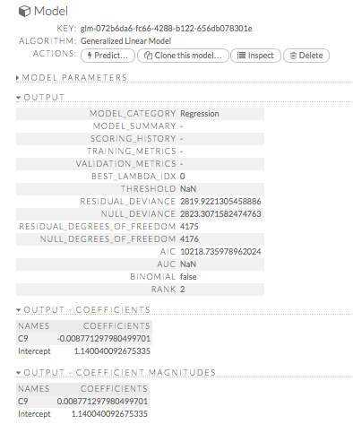

# GLM Tutorial

The purpose of this tutorial is to walk new users through Generalized Linear Analysis (GLM) using H2O Flow.

Those who have never used H2O before should refer to <a href="https://github.com/h2oai/h2o-dev/blob/master/h2o-docs/src/product/flow/README.md" target="_blank">Getting Started</a> for additional instructions on how to run H2O Flow.

For more details on the math behind H2O's implementation of GLM, refer to <a href="http://docs.h2o.ai/datascience/glm.html" target="_blank">GLM Data Science</a>. 

**Note**: GLM in H2O-Dev may provide slightly different coefficient values when applying an L1 penalty in comparison with H2O1.

###Using GLM
Use GLM when the variable of interest relates to predictions or inferences about a rate, an event, or a continuous measurement or for questions about how a set of environmental conditions influence the dependent variable.

Here are some examples:

- "What attributes determine which customers will purchase, and which will not?"
- "Given a set of specific manufacturing conditions, how many units produced will fail?"
- "How many customers will contact help support in a given time frame?"

### Getting Started
This tutorial uses a publicly available data set that can be found at the UCI Machine Learning Repository: <a href="http://archive.ics.uci.edu/ml/machine-learning-databases/abalone/" target="_blank">http://archive.ics.uci.edu/ml/machine-learning-databases/abalone/</a>.

The original data are the Abalone data, available from UCI Machine Learning Repository. They are composed of 4177 observations on 9 attributes. All attributes are real valued, and continuous, except for Sex and Rings, found in columns 0 and 8 respectively.
Sex is categorical with 3 levels (male, female, and infant), and Rings is an integer valued count.

To further explore H2O's capabilities, some <a href="http://docs.h2o.ai/resources/publicdata.html" target="_blank">publicly available data sets</a> can be found on our website. 

####Importing Data
Before creating a model, import data into H2O:

0. Click the **Assist Me!** button in the *Help* tab in the sidebar on the right side of the page. 
 

0. Click the **importFiles** link and enter the file path to the dataset in the **Search** entry field, or drag and drop the file onto the **Search** entry field and press Enter to confirm the file drop.  
0. Click the **Add all** link to add the file to the import queue, then click the **Import** button. 

  

####Parsing Data
Now, parse the imported data: 

0. Click the **Parse these files...** button. 

  **Note**: The default options typically do not need to be changed unless the data does not parse correctly. 

0. From the drop-down **Parser** list, select the file type of the data set (Auto, XLS, CSV, or SVMLight). 
0. If the data uses a separator, select it from the drop-down **Separator** list. 
0. If the data uses a column header as the first row, select the **First row contains column names** radio button. If the first row contains data, select the **First row contains data** radio button. To have H2O automatically determine if the first row of the dataset contains column names or data, select the **Auto** radio button. 
0. If the data uses apostrophes ( `'` - also known as single quotes), check the **Enable single quotes as a field quotation character** checkbox. 
0. To delete the imported dataset after parsing, check the **Delete on done** checkbox. 

  **NOTE**: In general, we recommend enabling this option. Retaining data requires memory resources, but does not aid in modeling because unparsed data can’t be used by H2O.

0. Review the data in the **Data Preview** section, then click the **Parse** button.  

  

  **NOTE**: Make sure the parse is complete by clicking the **View Job** button and confirming progress is 100% before continuing to the next step, model building. For small datasets, this should only take a few seconds, but larger datasets take longer to parse.

### Building a Model

0. Once data are parsed, click the **Assist Me!** button, then click **buildModel**. 
0. Select `glm` from the drop-down **Select an algorithm** menu, then click the **Build model** button.  
0. If the parsed Abalone .hex file is not already listed in the **Training_frame** drop-down list, select it. Otherwise, continue to the next step. 
0. In the **Ignored_Columns** field, select all columns except columns 1 and 9 from the *Available* section to move them into the *Selected* section.
**Note**: You must include at least 2 columns. 
0. In the **Response** field, select the column associated with the Whole Weight variable (`C1`).
0. Leave the **Do_Classification** checkbox checked. Use classification when the dependent variable (column 1 in this example) is a binomial classifier. 
0. Uncheck the **Standardize** checkbox.
0. From the drop-down **Family** menu, select `gaussian`. 
0. Enter `0` in the **N_folds** field. If **N_folds** is greater than 0, the model displays the specified number of cross-validation models.  
0. Enter `0.3` in the **Alpha** field. The alpha parameter is the mixing parameter for the L1 and L2 penalty.
0. Enter `.002` in the **Lambda** field. 
0. Click the **Build Model** button.

 

### GLM Results

To view the results, click the **View** button. The GLM output includes coefficients (as well as normalized coefficients when
standardization is requested). The output also displays AIC, AUC, and deviance rates.  

To view more details, click the **Inspect** button. 

 
 
To view the best lambda values, click the **Best Lambda** link. 

  

